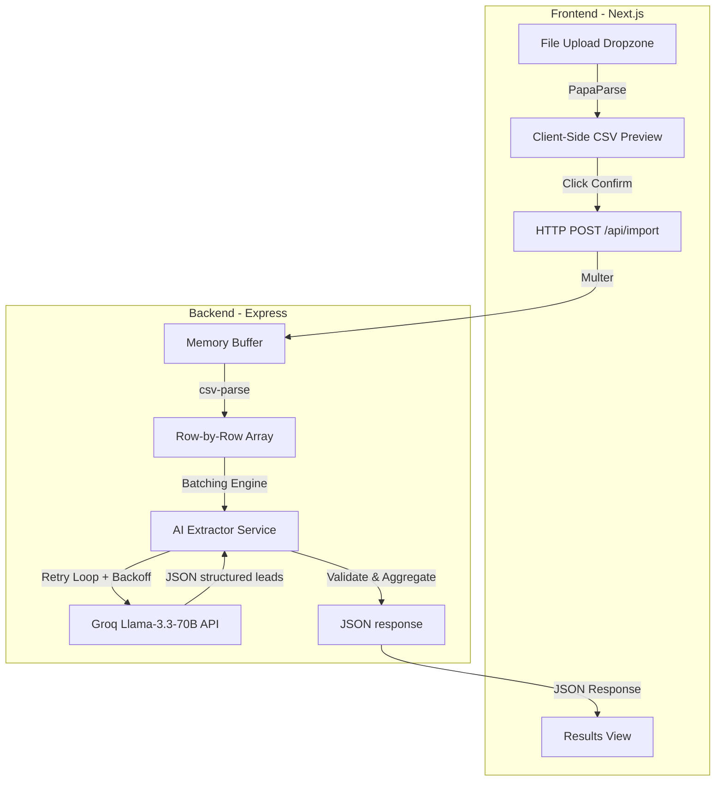

# System Architecture — GrowEasy CSV Importer

This document outlines the architecture, data flow, and components of the GrowEasy AI-powered CSV Importer.

---

## High-Level Architecture

The system follows a classic decoupled client-server architecture:



---

## 1. Frontend Flow (Next.js)

The client application is designed as a **deterministic State Machine** with 4 steps:

```
┌──────────┐      Parse Locally      ┌───────────┐
│  Upload  ├────────────────────────>│  Preview  │
└──────────┘                         └─────┬─────┘
     ▲                                     │
     │ Reset                               │ Confirm & Send File
     │                                     ▼
┌────┴─────┐      Render Results     ┌───────────┐
│ Results  │<────────────────────────┤Processing │
└──────────┘                         └───────────┘
```

- **Upload Step**: Captures the CSV file using browser drag-and-drop APIs. Performs initial client-side validation (checks file extension and limits size to 50MB).
- **Preview Step**: Uses **PapaParse** to parse the raw CSV in-browser. The parsed rows are rendered inside a **virtualized table** (using `@tanstack/react-virtual`) which enables smooth 60fps scrolling for files with thousands of rows by rendering only visible rows in the viewport.
- **Processing Step**: Triggers the upload to the Express backend. A simulation engine runs in tandem with the API call to update the progress bar and cycle contextual messaging (e.g., "Analyzing headers...", "Mapping emails...").
- **Results Step**: Receives the final structured payload. Separates successful imports from skipped rows (rows missing both email and phone) and offers one-click **Export to CSV**.

---

## 2. Backend Flow (Express + TypeScript)

The backend is stateless, designed to process files in a pipeline without requiring a database.

### File Ingestion Pipeline
1. **Multer Middleware**: Accepts `multipart/form-data` uploads, storing the file buffer temporarily in memory to maximize processing speed.
2. **CSV Parser**: Converts raw buffer to a structured JavaScript array. Uses the stream-based `csv-parse` module, configured to handle:
   - Byte Order Mark (BOM) stripping.
   - Quoted field escape sequences.
   - Varied delimiters (commas, semicolons, tabs).
   - Relaxed column counts.

---

## 3. AI Extraction Engine (Groq)

The extraction engine uses **Llama 3.3 70B** via Groq for high-throughput, structured extraction.

### Batching Architecture
To handle files of arbitrary size while respecting LLM context limits and rate limits, rows are grouped into batches of **20 records**:

```
[Raw Rows 1-100]
   ├── Batch 1: Rows 1-20   ──> [ Groq API ] ──> [ Validated Leads 1-18 ] + [ Skipped 2 ]
   ├── Batch 2: Rows 21-40  ──> [ Groq API ] ──> [ Validated Leads 21-40 ]
   ├── Batch 3: Rows 41-60  ──> [ Groq API ] ──> [ Validated Leads 41-59 ] + [ Skipped 1 ]
   ├── Batch 4: Rows 61-80  ──> [ Groq API ] ──> [ Validated Leads 61-80 ]
   └── Batch 5: Rows 81-100 ──> [ Groq API ] ──> [ Validated Leads 81-100 ]
```

### Retry with Exponential Backoff
If a batch request fails (due to rate limiting, network timeout, or bad API response), the retry controller intervenes:
- **Maximum Retries**: 3 attempts.
- **Backoff Interval**: $2^{\text{attempt}} \times 1000\text{ ms}$ (e.g., 2s, 4s, 8s).
- **Graceful Failover**: If all 3 attempts fail, the rows in that batch are marked as skipped with a diagnostic error message, allowing the rest of the import to finish.

---

## 4. Prompt Engineering & JSON Mode

We use Groq's **JSON Object Mode** to guarantee parser compatibility.

### System Instructions
```
You are an expert CRM data extraction engine. You ONLY output valid JSON objects. Never add explanations, markdown, or code fences. Output raw JSON only.
```

### Prompt Mechanics
1. **Dynamic Schema Feeding**: The system feeds the source CSV headers and a batch of rows to the prompt.
2. **Enum Mapping Rules**:
   - `crm_status` must be mapped to one of: `GOOD_LEAD_FOLLOW_UP`, `DID_NOT_CONNECT`, `BAD_LEAD`, `SALE_DONE`.
   - `data_source` must match a specific GrowEasy project identifier.
3. **Data Splitting**:
   - Multiple emails/phone numbers → first goes into main fields, remaining contacts are appended to `crm_note`.
   - Splitting names → combines `first_name` and `last_name` columns into `name`.
4. **Invalid Row Filtering**:
   - The LLM skips rows lacking both email and phone. The backend does a secondary validation check to guarantee no invalid records leak through.

---

## 5. Security & Performance

- **In-Memory Uploads**: Multer memory storage ensures zero residual disk footprints from uploaded files.
- **Low AI Temperature**: Set to `0.1` for maximum determinism and consistency across extractions.
- **CORS Config**: Strictly restricted to local development origins (`localhost:3000`) and the designated production Vercel domain.
- **Stateless Operation**: Allows simple scaling — can be deployed as serverless functions (like Vercel API routes) or multiple load-balanced server containers.
